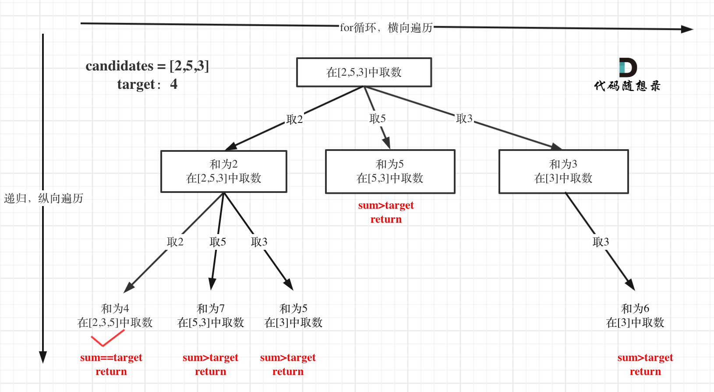

[39. Combination Sum](https://leetcode.com/problems/combination-sum/submissions/1801267022/)
```python
class Solution(object):
    def combinationSum(self, candidates, target):
        """
        :type candidates: List[int]
        :type target: int
        :rtype: List[List[int]]
        """
        path = []
        res = []

        def backtracking(candidates, target, start):
            if target == 0:
                #使用深拷贝
                res.append(path[:])
                return
            for i in range(start, len(candidates)):
                path.append(candidates[i])
                # 这里的判断值为>=0， 如果>0，则会无法进入下一层收集结果
                if (target - candidates[i]) >= 0:
                    # 这里需要起始索引，每一次起始索引要符合当前遍历索引
                    # 避免重复
                    backtracking(candidates, target-candidates[i], i)
                path.pop()
        
        backtracking(candidates, target, 0)

        return res
```
理解的树状图


1。 如果是一个集合来求组合的话，就需要startIndex

[40. Combination Sum II](https://leetcode.com/problems/combination-sum-ii/)
```python
class Solution(object):
    def combinationSum2(self, candidates, target):
        """
        :type candidates: List[int]
        :type target: int
        :rtype: List[List[int]]
        """
        res = []
        path = []
        # 初始化一个used, 用于层级去重
        used = [False for _ in range(len(candidates))]
        candidates.sort()

        def backtracking(target, start, used):
            if target < 0: return
            if target == 0:
                res.append(path[:])
                return
            for i in range(start, len(candidates)):
                # 如果当前数字与前一个数字相同，即代表前一个数字后面的组合已经包括了当前的所有组合情况
                # 如 [1,1,2], 以index=0时， 已经包含了index=1的组合， 即 1,2 会出现两次， 可略过 index=1
                # 同时需要确保这不是在当前递归中本身数字重复， 而是出现了，循环中遍历到第i个数字， 与i-1重复
                # 这时候， 因为没有进入递归， 所以used[i-1]是false， 即还没有被使用过。
                # 根据此判断条件就会避免出现重复的情况
                if i>0 and candidates[i] == candidates[i-1] and not used[i-1]:
                    continue
                num = candidates[i]
                path.append(num)
                used[i] = True
                backtracking(target-num, i+1, used)
                path.pop()
                used[i] = False
        
        backtracking(target,0,used)
        return res
```

1. **排序 `candidates.sort()`**

   * 让相同的数字相邻，方便后续的去重判断。

2. **`used` 数组作用**

   * 它标记的是「同一条搜索路径中」数字是否被使用。
   * 当 `not used[i-1]` 时跳过，表示「当前层级」已经处理过相同数字。

3. **`if i>0 and candidates[i] == candidates[i-1] and not used[i-1]: continue`**

   * 避免生成重复组合的关键条件。
   * 示例说明：

     ```
     candidates = [1,1,2]
     ```

     * 当第一个 1（index=0）处理完后，第二个 1（index=1）在同一层级时被跳过；
     * 但当第二个 1 出现在递归分支中（即 index=0 的 1 已被使用），则可以使用。

4. **`backtracking(i + 1, target - num)`**

   * 从下一个位置开始递归，因为每个数字只能用一次（区别于 combinationSum）。


[131. Palindrome Partitioning](https://leetcode.com/problems/palindrome-partitioning/description/)
```python
class Solution(object):
    def partition(self, s):
        """
        :type s: str
        :rtype: List[List[str]]
        """

        res = []
        path = []

        def is_palindrome(s):
            return s == s[::-1]

        def backtracking(start):
            if len(s) == start:
                res.append(path[:])
                return
            
            for i in range(start, len(s)):
                substring = s[start:i+1]
                if not is_palindrome(substring):
                    continue
                path.append(substring)
                backtracking(i+1)
                path.pop()
        
        backtracking(0)
        return res
```