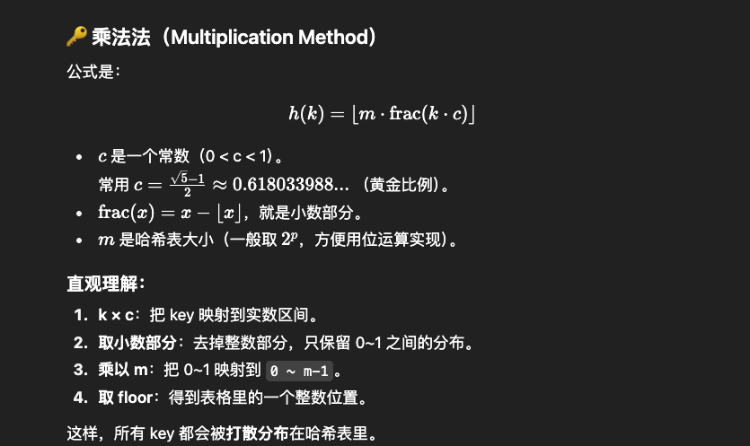

### Concept Explain
1. Key: a input in the hash function that determines the location for the storage
2. Hash Function: input Key, output hash index
3. Hash Table: map key, value pairs using hash function.

- Hash stores the data in an associative manner in an array where each data value has its own unique index.

4. Collision: two key possibility that two keys could produce same value
5. Load Factor: determined by how many elements are there in relation to how big the table is. 当元素越来越多，超过一定负载因子（load factor，比如 0.75），哈希表就会自动 扩容（resize），重新分配更大的数组（比如从 16 扩到 32），再把已有的元素重新哈希一遍（rehash）。
6. bucket: bucket（桶） 就是数组的一个槽位（slot），用来存放哈希到同一个位置的 一个或多个键值对 (key, value)。

### Hash Function ([url](https://www.geeksforgeeks.org/dsa/what-are-hash-functions-and-how-to-choose-a-good-hash-function/))
A function that translates keys to array indices is known as a hash function.

- Integer universe assumption
- Division / Multiplication(bitwise operation)

- Good hash function: Efficiently Computable, Uniform Distribution of Keys(Simplicity, Minimize Collisions, Uniform Distribution, Consider All bits)



### Collision

Key1 != Key2 BUT Hash(Key1) == Hash(Key2)

1. Open Addressing: 

 ** H(i) = (Hash(key)+F(i)) mod m, i  = 1, 2, 3, ...... , n(n <= m-1)
    ** Linear Probing - i = + 1
    ** Quadratic probing - i = i * i
    ** Fake random sequeece

2. Chaining


# Appendix:

## 📌 普通数组的样子

比如：

```text
arr = [1212, 23123, 4124]
```

* 索引(index)： `0, 1, 2`
* 值(value)： `1212, 23123, 4124`

👉 在普通数组里，索引 = 下标，值 = 直接存的内容。

---

## 📌 哈希表里的数组

哈希表底层也是用数组，不过 **数组里放的不是直接的 value，而是 bucket（桶）**。

比如：

```text
table = [bucket0, bucket1, bucket2, ..., bucket(m-1)]
```

* **索引 (index)**： `0, 1, 2, ... m-1`
  （就是哈希函数算出来的值 h(k)）
* **数组里的值 (bucket)**： 代表这个位置的“桶”，桶里才真正存 key/value。

---

## 🧩 两种情况

### 1. 开放定址法

bucket 只存 **一个键值对 (key, value)**：

```text
table = [ (17, "a"),  (23, "b"),  empty,  (42, "c") ]
index     0              1         2        3
```

### 2. 链地址法

bucket 是一个 **链表 / 动态数组**，能存多个键值对：

```text
table = [ [(8,"x"), (12,"y")],   [(5,"z")],   [],   [(7,"w")] ]
index     0                     1             2     3
```

👉 这里每个方括号就是一个 bucket。

* `table[0]` 里存着一个链表：`[(8,"x"), (12,"y")]`
* `table[2]` 是空 bucket。

---

## 🎯 总结

* **数组的索引** = 哈希函数的结果 h(k)，决定元素应该放在哪个 bucket。
* **数组的值** = bucket，本质是一个存放数据的“容器”。
* **bucket 的内容** = 存放一个或多个 (key, value)。

---

也就是说，你举的 `[1212, 23123, 4124]` 在哈希表语境下，应该理解成：

* `0, 1, 2` 是数组索引
* `1212, 23123, 4124` 分别是 **bucket**，只是这里 bucket 里恰好直接存的是整数而已。

---

要不要我给你画一张 **图解（数组 + bucket + key/value）**，你一眼就能看出来 bucket 在数组里的位置和作用？
